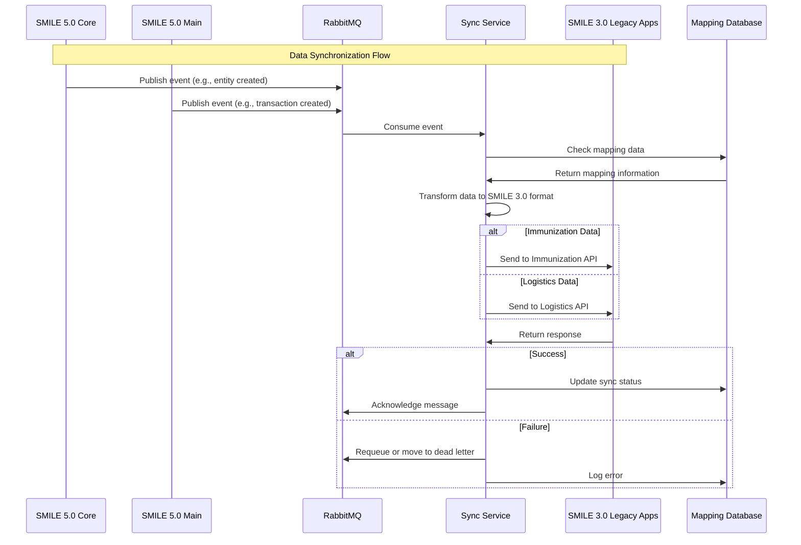
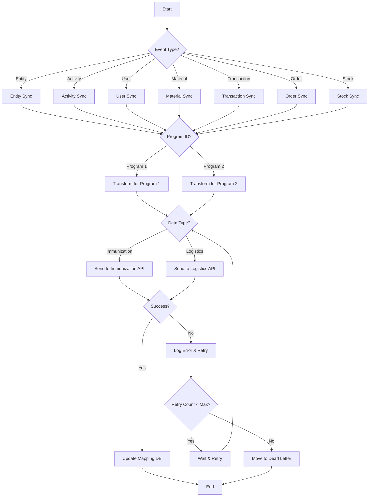
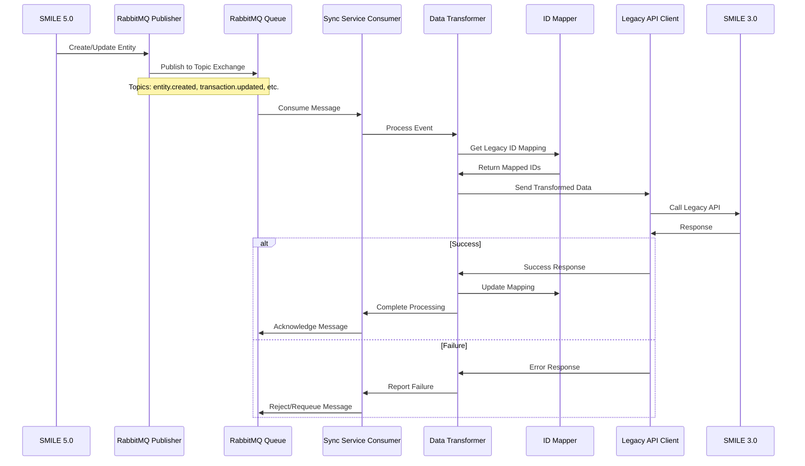

# SMILE Sync Service

## Overview

The SMILE Sync Service is a critical component of the SMILE 5.0 platform that facilitates integration between the new SMILE 5.0 monorepo application and the legacy SMILE 3.0 systems. This service is responsible for synchronizing business processes and data between the two systems through asynchronous communication using RabbitMQ.

## Purpose

The primary purpose of the Sync Service is to ensure data consistency between SMILE 5.0 (specifically the Core and Main services) and the legacy SMILE 3.0 applications. It acts as a bridge that allows both systems to operate in parallel during the transition period, ensuring business continuity while the migration to the new platform progresses.

## Architecture

```
┌─────────────────┐      ┌─────────────────┐      ┌─────────────────┐
│                 │      │                 │      │                 │
│  SMILE 5.0      │      │  Sync Service   │      │  SMILE 3.0      │
│  (Core/Main)    │─────▶│  (RabbitMQ)     │─────▶│  Legacy Apps    │
│                 │      │                 │      │                 │
└─────────────────┘      └─────────────────┘      └─────────────────┘
```

## Sequence Diagram

The following sequence diagram illustrates the data synchronization flow between SMILE 5.0 and SMILE 3.0:



## Workflow Diagram

The following workflow diagram shows the overall synchronization process:



The Sync Service follows an event-driven architecture:

1. **Event Production**: SMILE 5.0 services (Core and Main) produce events when data changes
2. **Message Queuing**: Events are published to RabbitMQ topics
3. **Event Consumption**: The Sync Service consumes these events
4. **Data Transformation**: Events are transformed to match the SMILE 3.0 data model
5. **Legacy Integration**: Transformed data is sent to SMILE 3.0 systems via their APIs

## Key Features

- **Asynchronous Processing**: Uses RabbitMQ for reliable message queuing and processing
- **Bulk Migration Tools**: Includes scripts for migrating large datasets between systems
- **Error Handling**: Robust error handling and retry mechanisms
- **Program-specific Synchronization**: Supports different synchronization rules per program (e.g., Program ID 1 and 2)
- **Entity-specific Handlers**: Dedicated synchronization logic for different entity types:
  - Activities
  - Entities
  - Users
  - Locations
  - Materials
  - Manufacturers
  - Budget Sources
  - Patients
  - Batches
  - Transactions
  - Orders
  - Stocks

## Integration Points

The service integrates with two main legacy systems:

- **Immunization System**: `SYNC_SERVER_URL_IMMUNIZATION`
- **Logistics System**: `SYNC_SERVER_URL_LOGISTIC`

## Detailed Synchronization Process



## Technology Stack

- **Runtime**: Bun/Node.js
- **Language**: TypeScript
- **Database**: MySQL
- **Message Broker**: RabbitMQ
- **API Client**: Axios
- **ORM**: Kysely
- **API Spec Generation**: Orval

## Setup and Configuration

### Prerequisites

- Node.js 20.x or Bun 1.x
- MySQL 8.x
- RabbitMQ 3.x
- Redis (for caching)

### Environment Variables

Create a `.env` file based on the provided `.env.example`:

```
NODE_ENV=development
PORT=4002
TIMEOUT=60
LOG_MODE=development

APP_NAME=MyApp
APP_KEY=my-secret-key
APP_DEBUG=true
APP_URL=http://localhost

SYNC_SERVER_URL_IMMUNIZATION=http://localhost
SYNC_SERVER_URL_LOGISTIC=http://localhost

DB_HOST=mysql
DB_USER=user
DB_PORT=3306
DB_PASSWORD=password
DB_NAME=testdb

REDIS_HOST=redis
REDIS_PASSWORD=
REDIS_PORT=6379

RABBITMQ_HOST=rabbitmq
RABBITMQ_PORT=5672
RABBITMQ_USERNAME=guest
RABBITMQ_PASSWORD=guest

# Additional configuration...
```

### Installation

```bash
# Install dependencies
npm install

# Link shared library
pnpm link @smile-health/lib

# Generate database types
npm run build

# Generate OpenAPI clients
npm run build:openapi
```

## Database Migrations

The service includes scripts for migrating data from SMILE 3.0 to 5.0:

```bash
# Run database migrations
npm run db:migrate

# Migrate all entities
npm run migrate:all

# Migrate specific entities
npm run migrate:activity
npm run migrate:entity
npm run migrate:user
npm run migrate:location
npm run migrate:material
npm run migrate:manufacture
npm run migrate:budget-source
```

## Workspace Migrations

For workspace-specific migrations:

```bash
# Migrate all workspace entities
npm run migrate:ws:all

# Migrate specific workspace entities
npm run migrate:ws:batch
npm run migrate:ws:patient
npm run migrate:ws:trx-reason
npm run migrate:ws:entity
npm run migrate:ws:material
npm run migrate:ws:stock
npm run migrate:ws:order
npm run migrate:ws:transaction
```

## Development

```bash
# Start development server with hot reload
npm run dev

# Count migration statistics
npm run migrate:count
```

## Docker Deployment

The service includes a Dockerfile for containerized deployment:

```dockerfile
# Base image: Use the official Bun image
FROM oven/bun:1 AS base

# Install Node.js
RUN apt-get update && \
    apt-get install -y curl jq && \
    curl -fsSL https://deb.nodesource.com/setup_20.x | bash - && \
    apt-get install -y nodejs && \
    rm -rf /var/lib/apt/lists/*

# Set the working directory
WORKDIR /app

# Copy your application files
COPY . .

# Install dependencies (for Bun and npm)
RUN npm install

# Set the default command to run your application
CMD ["bun", "run", "src/index.ts"]
```

Build and run the Docker container:

```bash
docker build -t smile-sync-service .
docker run -p 4002:4002 --env-file .env smile-sync-service
```

## Troubleshooting

Common issues and solutions:

- **Connection Issues**: Ensure RabbitMQ and database connections are properly configured
- **Sync Failures**: Check logs for specific error messages
- **Data Inconsistencies**: Use migration scripts to resync specific entities

## Contributors

- Hafiz
- Alif
- Albian
- Ibnu
- etc

## License

ISC